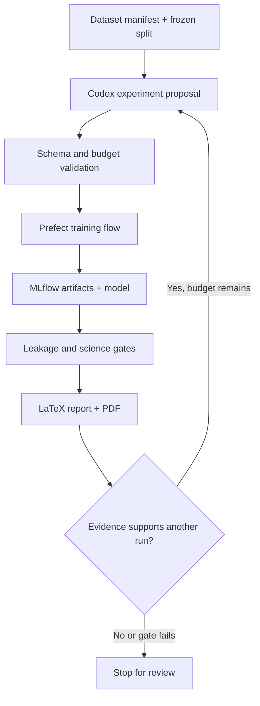

# Strata-OT Research

Semi-autonomous, reproducible research infrastructure for learning atmospheric optical-turbulence strength \(C_n^2\) and vertical profiles.

This repository is deliberately research-first:

- direct observations stay distinguishable from WRF/LES teacher labels;
- time, site, campaign, instrument, and geometry leakage are treated as test failures;
- every run records code, data, split, configuration, hardware, cost, metrics, checkpoints, and figures;
- all completed scientific reports are generated from LaTeX and compiled to PDF;
- Codex proposes bounded experiments but cannot silently change sealed data or success criteria.

The first target is a real, direct-label run on the public `otbench` Mauna Loa task using the small **Strata-OT Surface** neural model. The next target is **Strata-OT Column** on an OTProf subset, followed by observed profile fine-tuning.

## Development hardware

The default configuration is designed for one NVIDIA RTX 5080 with 16 GB VRAM:

- 2–8M parameters for the first direct-label model
- 8–15M parameters for the first column model
- BF16 mixed precision
- bounded batches plus gradient accumulation
- no multi-GPU assumptions

Cloud GPU jobs are optional and require a separate approval and dollar ceiling.

## What runs locally

| Service | Purpose | URL |
| --- | --- | --- |
| Research console | Clean experiment and dataset overview | <http://localhost:3000> (or `STRATA_WEB_PORT`) |
| Research API | Aggregated status and run metadata | <http://localhost:8000/docs> |
| MLflow | Metrics, predictions, figures, checkpoints, and candidate lineage | <http://localhost:5000> |
| Prefect | Flows, retries, schedules, logs | <http://localhost:4200> |

## Quick start

From WSL2 or Linux:

```bash
cp .env.example .env
./scripts/bootstrap.sh
docker compose up -d postgres mlflow prefect api web
./scripts/first-real-run.sh
```

From PowerShell:

```powershell
Copy-Item .env.example .env
./scripts/bootstrap.ps1
docker compose up -d postgres mlflow prefect api web
./scripts/first-real-run.ps1
```

The bootstrap script installs `uv`, project dependencies, DVC metadata, and frontend dependencies. It does not accept gated dataset terms or rent a GPU.

On Windows, set `STRATA_NUM_WORKERS=0` for the verified host-side data-loader
path. If port 3000 is occupied, set `STRATA_WEB_PORT=3002` in `.env` before
starting Compose. The exact acquisition, probe, training, gate, report, and
validation commands are recorded in
[`docs/FIRST_REAL_RUN.md`](docs/FIRST_REAL_RUN.md).

If the ML terminology is new, start with
[`docs/START_HERE.md`](docs/START_HERE.md). The current short-horizon forecast
validation and its exact commands are in
[`docs/SHORT_FORECAST_RUN.md`](docs/SHORT_FORECAST_RUN.md).
The frozen protocol for the completed development-only MLO weather-by-horizon
Cycle 0 is in
[`docs/NEXT_EXPERIMENT.md`](docs/NEXT_EXPERIMENT.md). It preregisters the
selection/calibration/assessment split, feature allowlists, custom Horizon v1
architecture, success rules, resource limits, and assessment-release gate.
The active rolling-origin **Strata-OT Fusion v2** research program is frozen in
[`docs/FUSION_V2_PROGRAM.md`](docs/FUSION_V2_PROGRAM.md). It preserves the
negative Cycle 0 result, uses public USNA-large training periods for ablations,
and protects a one-shot 2022 confirmation slice behind an explicit release
gate.

The acquisition adapter checks out the public `otbench` repository at commit
`53cab9d53648b4870b43e35d48f19143786fa12e` and calls its `TaskApi`. This pin is
intentional: the current PyPI wheel omits files required by the task loader.
The checked-in verified manifest describes 9,857 rows, 87 features, and the
official 5,516/1,892/2,449 train/validation/test partitions. Raw bytes remain
outside Git and are accepted only when their hashes match that manifest.

## First reproduced result

The first real local run completed on the RTX 5080 using the frozen
`otbench-mlo-blocked-v1` split. Persistence was best overall with blocked-test
RMSE 0.2751 log10 \(C_n^2\). The best neural run was the compact MLP at RMSE
0.4008; its two-seed mean was 0.4174. Strata-OT Surface averaged 0.6476 across
two seeds. Neural training used 0.0481 GPU-hours and peaked at 0.4937 GB
allocated VRAM.

The sealed evidence gate remains open: the eligible MLP's nominal 80% interval
covered 100% of the test targets. Provenance, split-overlap, train-only
preprocessing, reproducibility, stability, and resource checks passed. No model
was promoted and the gate was not weakened. See the generated
[`experiment-report.pdf`](reports/generated/first-real-run/experiment-report.pdf)
for the full evidence and limitations.

## Current validation: a fair short forecast

The next bounded test asks a simpler, better-controlled question: using six
recent Cn² observations plus weather, can a model predict the next observation
better than copying the latest value? MLO is development-only; its previous
sealed test is not reused. The configuration is then frozen before a one-shot
confirmation on the independent public OTBench USNA surface-layer task.

This path fixes the information mismatch in the first experiment, adds recent
mean and LightGBM comparators, rejects irregular histories, replaces the
hard-clamped uncertainty scale with a smooth positive scale, and calibrates that
scale on validation only. It retains the immutable split and evidence gates and
uses a stricter two-GPU-hour local budget.

The frozen one-shot USNA confirmation is now complete. LightGBM was best overall
at test RMSE 0.1408. The compact MLP averaged 0.1444 across seeds 17 and 41,
improving 3.07% over persistence (0.1490); a paired 24-hour block bootstrap gave
a 95% improvement interval of 0.85% to 4.36%. Strata-OT Surface averaged
0.1463, so its added complexity did not beat the MLP or LightGBM.

No model was promoted. The immutable evidence gate remains open because the
best eligible MLP's mean nominal 80% interval coverage was 90.50%, just above
the 90% maximum. Provenance, leakage, train-only preprocessing,
reproducibility, stability, and resource checks passed. Combined MLO and USNA
neural work used 0.1451 GPU-hours and peaked at 0.1754 GB allocated VRAM. See
[`forecast-report.pdf`](reports/generated/short-forecast-validation/forecast-report.pdf)
for the complete claim-to-evidence record.

The next experiment does not revisit that released USNA test. It uses only the
existing MLO training and validation snapshot to ask whether operational
weather adds value at 5, 15, 30, and 60 minutes. Assessment remains hidden
behind an explicit release flag until the protocol and implementation are
committed; the official MLO test remains sealed.

## The guarded loop



Codex is the reasoning and coding layer. Prefect, schemas, immutable manifests, Git, DVC, and MLflow are the control and evidence layers.

After Phase 1, a bounded multi-cycle invocation is:

```bash
uv run strata-loop --execute --max-iterations 3 --max-total-gpu-hours 4
```

It stops on a sealed-gate pass, the shared local budget, or the iteration
ceiling. Candidate promotion and cloud spending remain human decisions.

## Repository map

- `AGENTS.md` — durable rules for Codex and other agents
- `.agents/skills/` — project-local research, ML, LaTeX, cloud, and UI skills
- `configs/` — composable data/model/trainer/experiment configuration
- `src/strata_ot/` — datasets, models, training, evaluation, orchestration, API, and reporting
- `web/` — research console, not a marketing site
- `research/` — full LaTeX briefing, original archive, paper map, datasets, architecture, and bibliography
- `reports/` — LaTeX templates and generated run reports
- `schemas/` — machine-validated autonomous proposal contracts
- `cloud/` — opt-in SkyPilot job definitions
- `docs/` — phased execution plan and operating procedures

## Start with Codex

Open this repository in Codex and use the goal in [`GOAL.md`](GOAL.md). Phase 1 is complete only when a real `otbench` run is visible in MLflow, the research console can display it, and a compiled LaTeX PDF documents the result.

## Public-source boundary

The repository covers public atmospheric science, reproducible modeling, and model evaluation. Mission-specific adapters, controlled datasets, weapon-effects integration, and performance claims are out of the public repository and require the applicable review and authorization.
